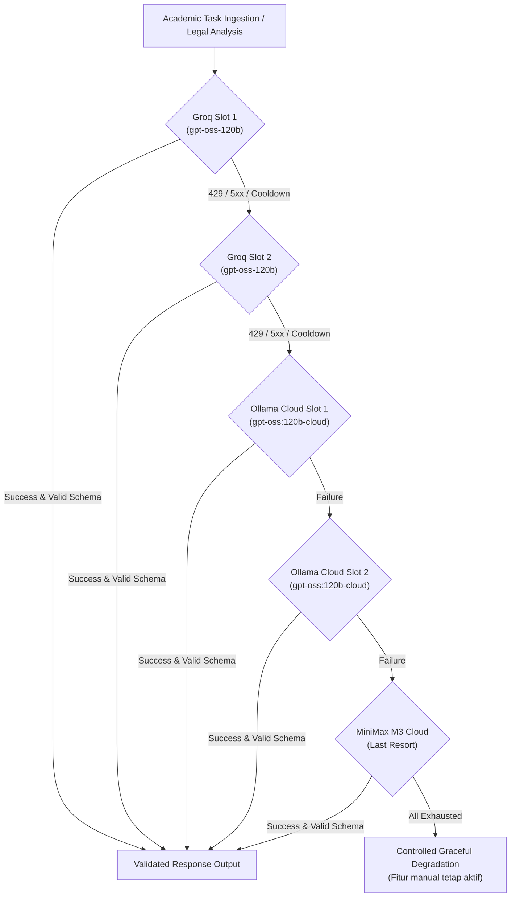

# ForFH V4 - AI Routing Architecture & Fallback Hierarchy

## 1. Provider Routing Strategy

ForFH implements a resilient, multi-tiered AI architecture designed to maximize uptime and rate limit headroom across multiple API keys.

---

## 2. Structured JSON Output & Schema Validation

### 2.1 Single Repair Attempt Policy
When an AI endpoint expects structured output (e.g. `task_parse`, `breakdown`, `smart_deadline`, `legal_explain`):
1. The model output is stripped of markdown code blocks (`cleanJsonOutput`).
2. The JSON payload is validated using a strict **Zod Schema** (`options.responseSchema.safeParse(...)`).
3. If parsing or schema validation fails:
   - Exactly **ONE** repair request is triggered with `isRepair: true` and the schema definition.
   - The repaired payload is validated with Zod.
   - If validation fails again, the request **fails closed** (never falls back to raw or unvalidated JSON).

### 2.2 Recursion Guard
Calls with `isRepair: true` cannot initiate subsequent repairs, strictly preventing infinite recursive execution loops.

---

## 3. Circuit Breaker Specification

Implemented in `src/lib/ai/circuit-breaker.ts`:

- **States**: `HEALTHY` | `COOLDOWN`.
- **429 Rate Limit**: Slot enters `COOLDOWN` using the duration specified in the `Retry-After` header (or 60 seconds default).
- **5xx Server Errors**: Exponential backoff ($5 \times 2^{\text{failureCount}}$ seconds, capped at 60 seconds).
- **3 Consecutive Failures**: Enforces cooldown to prevent downstream latency spikes.
- **Success Recovery**: Any successful request resets `failureCount = 0` and restores state to `HEALTHY`.

---

## 4. AI Usage Auditing

Every interaction (success or failure) is logged to the `ai_usage` table:
- Provider name (`groq` | `ollama`)
- Account slot (`1` | `2`)
- Model name
- Request type (`task_parse`, `legal_explain`, etc.)
- Latency in milliseconds
- Input and output token counts
- Error classification (e.g. `HTTP_429`, `TIMEOUT`, `NETWORK_ERROR`)
