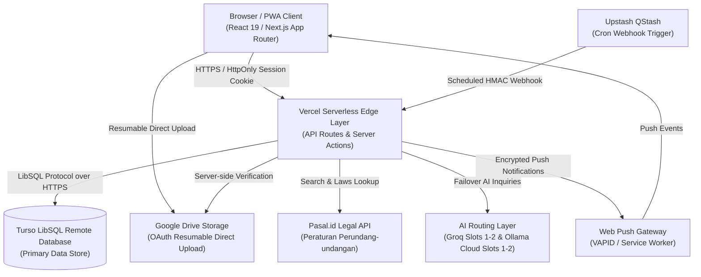

# ForFH V4 - System Architecture Documentation

## 1. High-Level Architecture Overview

ForFH (Faculty of Law Academic OS) is built as a serverless, multi-user, production-ready web application optimized for deployment on **Vercel** with a distributed **Turso (LibSQL)** database backend.

---

## 2. Component Design & Responsibilities

### 2.1 Web & Application Layer
- **Framework**: Next.js 15.1.7 (App Router), React 19.
- **Styling**: Vanilla CSS Modules + Tailwind CSS with dark mode support and modern typographic hierarchy (Inter & Plus Jakarta Sans).
- **Execution Environment**: Stateless Serverless Functions on Vercel. No persistent local files or long-running daemon dependencies.

### 2.2 Database & Data Persistence
- **Engine**: Turso (LibSQL distributed SQLite).
- **ORM**: Drizzle ORM (`drizzle-orm/libsql`).
- **Migration Strategy**: Declarative migrations generated via `drizzle-kit generate` (`0000_youthful_changeling.sql`) executed against Turso via `npm run db:migrate`.
- **Runtime Guard**: Local SQLite files (`file:`) are strictly blocked in production runtime.

### 2.3 Authentication & Session Management
- **Login Kampus (pengganti total username/password internal)**: `/api/auth/login` menerima email kampus + password, memverifikasi ke Kampus Kita UNAIR (`POST /auth/login`, UA `Dart/3.3`), dan otomatis membuat user ForFH dari email pertama kali. Kolom `password` nullable tidak terpakai (login hanya lewat kampus).
- **Session Cookies**: High-entropy 256-bit random tokens (64 hex characters) stored in HttpOnly, Secure, SameSite=Lax cookie (`__Host-forfh-session` in production, `forfh-session` in development).
- **Raw Session Token Storage**: token sesi disimpan apa adanya di `sessions.token` (nilai asli = nilai tersimpan, tanpa hashing — keputusan app pribadi).
- **Rate Limiting**: Database-backed sliding window rate limiting pada `/api/auth/login` (kampus) & `/api/campus/hebat` (5 attempts / 5 mins, 15 min lockout).

### 2.7 Campus Sync Layer (Kampus Kita + HE-BAT)
- **`src/lib/campus/kampuskita.ts`** — client API Kampus Kita (JWT via header `Set-Cookie token=`, auth `Bearer` + `?token=`): `jadwal()`, `presensi()`, `semesters()`, `khs(id)`, `status()`, `pesertaMataKuliah()`, `kalenderAkademik()`, `pembayaran()`, `dosenWali()`, `masaStudi()`, `sksAktif()`, `histHer()`, `penyerahanKtm()`.
- **`src/lib/campus/hebat.ts`** — login form Moodle standar (logintoken CSRF) sekali saat connect → scrape `#calendarexporturl` → simpan `authtoken` apa adanya. Sync berikutnya pakai `export_execute.php?authtoken=...` tanpa sesi; `parseIcs` mengurai iCal.
- **`src/lib/campus/mappings.ts`** — pemetaan murni (iCal → tasks, jadwal KK → courses/class_schedules, KHS → grades, presensi KK → rekap per MK) dengan konvensi field UPPERCASE_SNAKE; deterministic & diuji.
- **`src/lib/campus/sync.ts`** — `runCampusSync(userId, {force})` idempoten: upsert by `external_id` (UID iCal / kode MK), link course by kode, notifikasi push untuk tugas baru (dedupe `notification_deliveries` offset 0), throttle 30 menit (`FORFH_SYNC_INTERVAL_MIN`). Selain itu meng-upsert **`campus_data`** (8 jenis, toleran per jenis): rekap presensi (agregat per MK) + pembayaran, dosen wali, masa studi, SKS aktif, HER, KTM, kalender akademik.
- **`src/app/api/campus/info/route.ts`** — GET read-only seluruh `campus_data` user (`{connected, lastSyncAt, items:[{jenis, data, updatedAt}]}`); halaman `/info-kampus` menampilkannya, halaman `/kehadiran` memfilter jenis `presensi`.
- **Cron**: tick `syncDueUsers()` berjalan di webhook QStash `internal/reminders/process` yang sama (tanpa jadwal baru), per-user try/catch, cap 20 user/tick.
- **Presensi KK disinkronkan sebagai rekap agregat** (`campus_data`, jenis `presensi`); tidak dipetakan ke baris `attendance` (tetap manual per tanggal di halaman Kehadiran).
- **Token plaintext at-rest**: nilai asli disimpan apa adanya (`jwt`, `hebat_authtoken`); data lama berformat `v1:` di-decrypt sekali jalan via `src/lib/crypto/legacy-v1.ts` — lihat `docs/SECURITY.md` §0.

### 2.4 AI Routing & Graceful Degradation
- **Provider Priority Pipeline**:
  1. Primary: **Groq Slot 1** (`openai/gpt-oss-120b`).
  2. Alternate: **Groq Slot 2**.
  3. Secondary Fallback: **Ollama Cloud Slot 1** (`gpt-oss:120b-cloud`).
  4. Alternate: **Ollama Cloud Slot 2**.
  5. Last Resort: **MiniMax M3 Cloud** (`minimax-m3:cloud`).
  6. Final Fallback: Graceful degradation returning structured offline notice without application disruption.
- **Circuit Breaker**: Slots record errors (429, 5xx). 3 consecutive failures put a slot into exponential cooldown (10s–60s). Successful requests reset cooldown immediately.
- **Structured Output Integrity**: Strict Zod schema parsing. If invalid, allows exactly **ONE** repair attempt. Rejects non-conforming responses (never fall back to unvalidated raw JSON).

### 2.5 Storage Architecture (Google Drive)
- **Direct Resumable Uploads**: Browser uploads directly to Google Drive via pre-authenticated resumable session URLs, avoiding serverless body-size bottlenecks.
- **Server-Side Verification**: Before recording file entries in Turso, `/api/files/record` validates existence, true MIME type, size, and parent folder against Google Drive API.
- **Multi-User Quotas**: Default 250 MB quota per student enforced prior to issuing upload sessions.

### 2.6 Background Tasks & Notifications (QStash & Web Push)
- **Scheduler**: Upstash QStash triggers `/api/internal/reminders/process` every 5 minutes.
- **Fail-Closed Security**: In production, QStash webhook requires valid `Upstash-Signature` verified via `Receiver({ currentSigningKey, nextSigningKey })`. Unsigned requests return `401 Unauthorized`.
- **Deduplication**: `notification_deliveries` table prevents duplicate reminders for the same event and offset window.
- **Dead Subscription Pruning**: 404/410 HTTP responses from push services automatically delete obsolete client subscriptions.

### 2.7 PWA & Offline Isolation
- **IndexedDB Scoping**: Local cache partitioned by `forfh-user-${userId}-v2` preventing data bleed between different user accounts on shared devices.
- **Logout Cleansing**: Client logout automatically triggers `clearUserCache(userId)` to sanitize local browser memory and IndexedDB stores.
